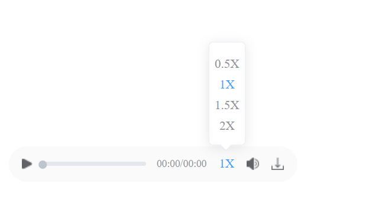

# 音频播放器 Audio

该组件是音频播放器 Audio，主要用于在各浏览器中统一样式

## 样式



## Attributes

| 参数   | 说明     | 类型   | require | 默认值 |
| ------ | -------- | ------ | ------- | ------ |
| src  | 音频的URL | String | true   | ''  |
| loop | 循环播放音频 | Boolean | false   | false   |
| autoplay | 自动播放 | Boolean | false   | false   |
| close | 当前播放器关闭，会触发音频暂停 | Boolean | false   | false   |
| isDual | 是否双规：设为true时，会显示声道切换按钮 | Boolean | false   | false   |
| customDownLoad | 是否自定义下载方法 | Boolean | false   | false   |
| tractData | 双规声道定义：label可以自定义，value中的值不可修改 | Array | false   | [{ label: '全部声道', value: 'all' },{ label: '坐席声道', value: 'left' },{ label: '客户声道', value: 'right' }]   |
| beforePlay | 组件没有传入src时，点击播放按钮触发 | Function | false   | () => Promise.resolve()   |


## Events

| 参数         | 说明                 | 回调参数 |
| ------------ | -------------------- | -------- |
| error | 音频加载失败时触发 | event       |
| download-fn | 当customDownLoad为true时，调应该方法 | --       |
| download-error | 音频下载失败时触发 | --       |
| audio-element | 组件创建时触发，调用该方法可以拿到 audioElement 对象| audioElement      |

## Example

```JavaScript
<template>
    <mi-audio 
        :src="src"
        loop
        autoplay
        isDual
        :beforePlay="beforePlay"
        :tractData="tractData"
        @audio-element="audioElement"
        @download-error="downloadError"
        @error="error"
    >
    </mi-audio>
</template>

<script>
export default {
    data() {
        return {
            src: 'https://123.456.789',
            tractData: [
                { label: '立体声', value: 'all' },
                { label: '左声道', value: 'left' },
                { label: '右声道', value: 'right' }
            ]
        }
    },
    methods: {
        beforePlay() {
            this.src = 'https://456.789.10'
        },
        audioElement(ele) {
            console.log('audioElement is ', ele)
        },
        downloadError() {
            console.log('下载失败')
        },
        error(event) {
            console.log('音频文件加载失败', event)
        }
    }
}
</script>

```
