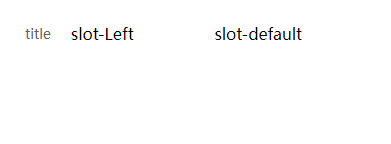

# content

该组件是Content，主要用于统一样式

## 样式



## Attributes

| 参数          | 说明           | 类型          | require | 默认值 |
| ------------- | -------------- | ------------- | ------- | ------ |
| title| content标题         | String/number | false    | ""     |
| width| 组件宽度         | String | false    | "277px"     |


## slot

| 参数   | 说明                 | 
| ------ | -------------------- | 
| right | 自定义左侧内容 |
| right | 自定义右侧内容 |

## Example

```JavaScript
<template>
    <div>
        <mi-content title="123">
            <template v-slot:left>
                <span style="margin-left: 20px">leftContent</span>
            </template>
            <template v-slot:right>rightContent</template>
        </mi-content>
    </div>
</template>

```
