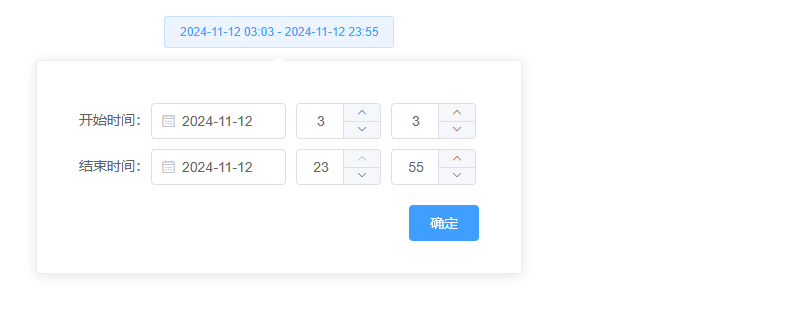

# Datetimespicker

该组件是Datetimespicker，提供日期时间 或 日期的选择

组件基于 element 用到的组件有：Popover 弹出框 && DatePicker 日期选择器 && InputNumber 计数器 && Button 按钮

组件用到的外部库： dayjs

## 样式



## Attributes

| 参数          | 说明           | 类型          | require | 默认值 |
| ------------- | -------------- | ------------- | ------- | ------ |
| v-model| 绑定值（初始值给定 []  即可，组件会自动赋初始值）,初始值格式：YYYY-MM-DD 00:00         | Array | true    | []     |
| themeColor| 组件主题颜色：false 为白色，true为灰色         | Boolea | false    | false     |
| removeTime| 移除时间选择         | Boolea | false    | false     |
| infiniteDate| 日期选择器可选择任意日期         | Boolea | false    | false     |
| pickerOptionsProp| 日期选择器配置项         | Object | false    | {disabledDate(time) {return moment(time).format('YYYY-MM-DD') < moment('2000-01-01 00:00:00').format('YYYY-MM-DD') || moment(time).format('YYYY-MM-DD') > moment().format('YYYY-MM-DD')}}     |


## Events

| 参数   | 说明                 | 回调参数     |
| ------ | -------------------- | ------------ |
| change | 点击确认时，触发 | callback（[开始时间，结束时间]） |


## Example

```JavaScript
<template>
       <mi-date-times-picker v-model="dateTime" @change="save"></mi-date-times-picker>
</template>
<script>
export default {
    data() {
        return {
            dateTime: []
        }
    },
    methods: {
        save(val) {
            console.log(val)
        }
    }
}
</script>

```
