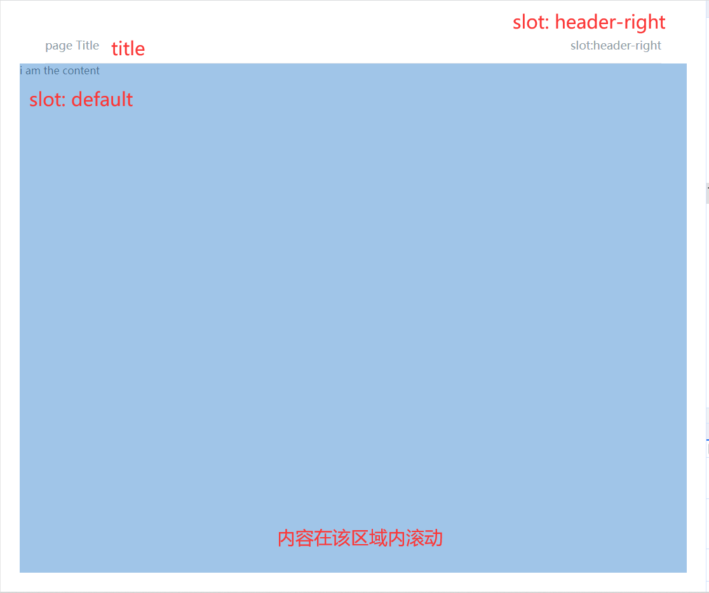

# title

该组件是 title page 组件，主要用于统一样式，简化 page 页面构建

## 样式



## Attributes

| 参数          | 说明           | 类型          | require | 默认值 |
| ------------- | -------------- | ------------- | ------- | ------ |
| title| 页面标题         | String/number | false    | ""     |
| noHeader| 去掉标题栏         | Boolean | false    | false     |
| basePageContainerClass| 为页面box添加类名         | String | false    | ""     |


## slot

| 参数   | 说明                 | 
| ------ | -------------------- | 
| header-left | 自定义header左侧内容 |
| header-right | 自定义header右侧内容 |
| default | 页面内容 |

## Example

```JavaScript
<template>
    <mi-title-page title="page Title">
        <template v-slot:header-right> slot:header-right </template>
        i am the content
    </mi-title-page>
</template>

```
