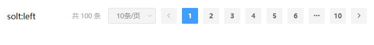

# Pagination

该组件是分页，主要用于统一样式


## 样式



## Attributes

| 参数          | 说明           | 类型          | require | 默认值 |
| ------------- | -------------- | ------------- | ------- | ------ |
| total | 总条目数   | Number | true    | 0  |
| current-page | 当前页数，需要使用 .sync 修饰符 | Number  | true   | 1  |
| page-size | 每页显示个数选择器的选项设置 | Number  | true   | 10  |
| jumper | 是否展示跳页元素 | Boolean  | false   | false  |
## Events

| 参数   | 说明                 | 回调参数     |
| ------ | -------------------- | ------------ |
| size-change | pageSize 改变时会触发 | 每页条数 |
| current-change | currentPage 改变时会触发 | 当前页 |
| prev-click | 用户点击上一页按钮改变当前页后触发 | 当前页 |
| next-click | 用户点击下一页按钮改变当前页后触发 | 当前页 |

## slot

| 参数   | 说明                 | 
| ------ | -------------------- | 
| default | 自定义左侧内容 |

## Example

```JavaScript
<template>
    <mi-pagination 
        :total="total" 
        :current-page.sync="currentPage" 
        :page-size.sync="pageSize"
        @prevClick="prevClick" 
        @nextClick="nextClick" 
        @sizeChange="sizeChange" 
        @currentChange="currentChange"
        jumper
        >solt:left</mi-pagination>
</template>

<script>
export default {
    data() {
        return {
            total: 100,
            currentPage: 1,
            pageSize: 10
        }
    },
    methods: {
        prevClick(val) {
            console.log('prevClick', val)
        },
        nextClick(val) {
            console.log('nextClick', val)
        },
        sizeChange(val) {
            console.log('sizeChange', val)
        },
        currentChange(val) {
            console.log('currentChange', val)
        }
    }
}
</script>

```
