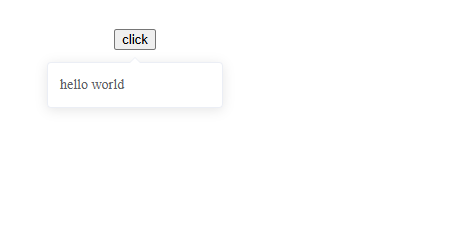

# Popover

该组件是 弹出框，与 ELEMENT-UI 中 Popover 组件的不同之处在于，可以不指定 reference,该组件目前只能通过指定 value 值来显示和隐藏 


## 样式



## Attributes

| 参数          | 说明           | 类型          | require | 默认值 |
| ------------- | -------------- | ------------- | ------- | ------ |
| value/v-model | 绑定值         | Boolean | true    | false     |
| width | 宽度 | String, Number  | false   | 最小宽度 150px  |
| placement | 出现位置 | String  | top/top-start/top-end/bottom/bottom-start/bottom-end/left/left-start/left-end/right/right-start/right-end   | bottom  |


## Slot

| 参数          | 说明           | 
| ------------- | -------------- | 
| — | Popover 内嵌 HTML 文本         | 
| reference | 触发 Popover 显示的 HTML 元素 | 
## Example

```JavaScript
<template>
    <div>
        <button @click="visible = true">click</button>

        <mi-popover v-model="visible" width="100">
            hello world
        </mi-popover>
    </div>
</template>
<script>
export default {
    data() {
        return {
            visible: false
        }
    },
    methods: {}
}
</script>

```
