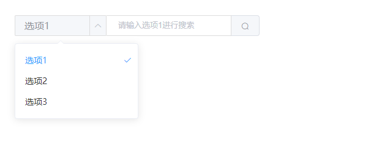

# 选择器输入框

该组件是选择器输入框，主要用于统一样式

## 样式



## Attributes

| 参数          | 说明           | 类型          | require | 默认值 | 备注
| ------------- | -------------- | ------------- | ------- | ------ | ---- |
| value/v-model | 绑定值         | String/Array | true    | ""     | 当包含 下拉框时，传入数组(['下拉框选中值', '输入框默认值'])。不包含时传入 字符串 |
| placeholder   | 输入框占位文本 | String        | false   | ""     | -- |
| selectWidth    | 下拉框宽度       | String/Number        | false   | 132  | -- |
| width         | 组件宽度       | String/Number        | false   | 321  | -- |
| selectList     | 下拉框列表数据 | Array         | false    | []     | 不传入该值，不展示 下拉框；数组项格式如下： { label: '选项1'， value: '1'} |

## Events

| 参数   | 说明                 | 回调参数     | 备注
| ------ | -------------------- | ------------ | -------- |
| change | 选中值发生变化时触发 | 目前的选中值 | 以下操作会触发该操作：下拉框选项更改、点击搜索按钮、清空输入框

## Example

```JavaScript
<template>
    <mi-select-input 
        v-model="value" 
        placeholder="请输入" 
        selectWidth="150" 
        :selectList="selectList" 
        width="400" 
        @change="handleChange"
    ></mi-select-input>
</template>
<script>
export default {
    data() {
        return {
            selectList: [
                {
                    label: '选项1',
                    value: '1'
                },
                {
                    label: '选项2',
                    value: '2'
                },
                {
                    label: '选项3',
                    value: '3'
                }
            ],
            value: ['1', '']
        }
    },
    methods: {
        handleChange(val) {
            console.log('handleChange', val)
        }
    }
}
</script>

```
