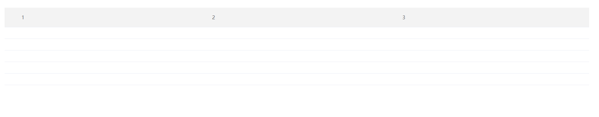

# Table 样式自定义

该类名 【 mi-table-header-cell 】 和 【 mi-table-cell 】用于自定义 element 组件 【Table】 样式, 以上两个 类名不能直接加到 class 中，需加入到如下属性中 
###### 【 header-cell-class-name="mi-table-header-cell" cell-class-name="mi-table-cell" 】
    
## 样式

