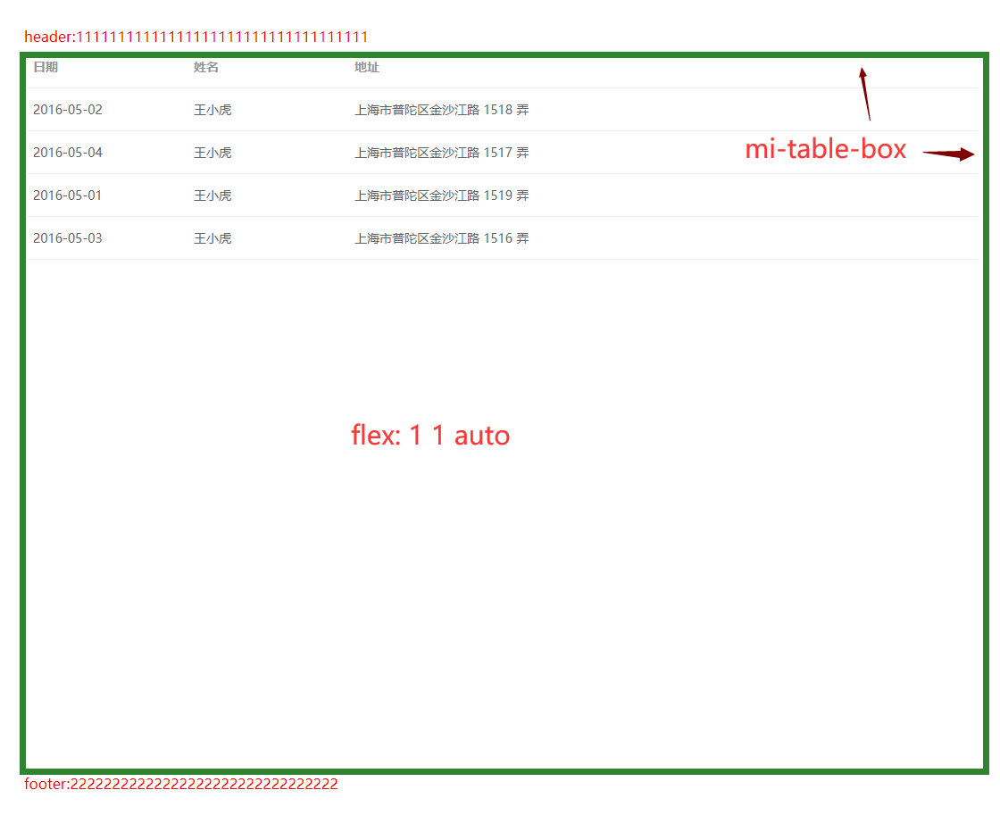

# TableBox

该组件是TableBox，主要用于包裹 table 组件，当窗口高度变化时，Table 组件高度会随之发生改变，当 数据较多时 会出现竖向滚动条

【el-table】设置 height="100%"

## 样式




## Example

```JavaScript
<template>
      <mi-table-box style="flex: 1 1 auto">
            <el-table :data="[]" height="100%">
                <el-table-column prop="date" label="日期" width="180"> </el-table-column>
                <el-table-column prop="name" label="姓名" width="180"> </el-table-column>
                <el-table-column prop="address" label="地址"> </el-table-column>
            </el-table>
        </mi-table-box>
</template>

```
