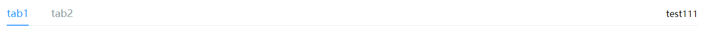

# 标签页

该组件是标签页，主要用于统一样式

## 样式



## Attributes

| 参数          | 说明           | 类型          | require | 默认值 |
| ------------- | -------------- | ------------- | ------- | ------ |
| value/v-model | 绑定值         | String/number | true    | ""     |
| panes          | 标签页数组 | Array         | true    | []     |

## Events

| 参数   | 说明                 | 回调参数     |
| ------ | -------------------- | ------------ |
| change | tab 被选中时触发 | 目前的选中值 |

## slot

| 参数   | 说明                 | 
| ------ | -------------------- | 
| right | 自定义右侧内容 |

## Example

```JavaScript
<template>
    <div>
        <mi-tabs v-model="active" :panes="list">
            <template v-slot:right>test111</template>
        </mi-tabs>
    </div>
</template>
<script>
export default {
    data() {
        return {
            active: '1',
            list: [
                {
                    label: 'tab1',
                    name: '1'
                },
                {
                    label: 'tab2',
                    name: '2'
                },
            ]
        }
    }
}
</script>

```
