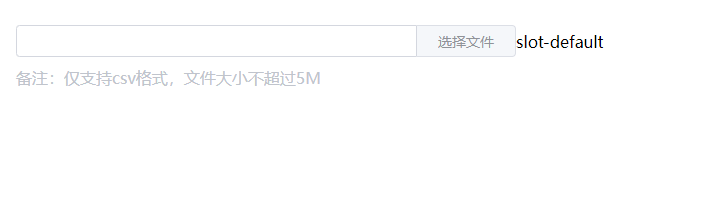

# title

该组件是文件上传，主要用于统一样式、简化上传流程，可用于 Form 表单


## 样式



## Attributes

| 参数          | 说明           | 类型          | require | 默认值 |
| ------------- | -------------- | ------------- | ------- | ------ |
| value/v-model | 绑定值   | string、object | true    | ''  |
| width         | 组件宽度 | String、Number  | false   | 320  |

## slot

| 参数   | 说明                 | 
| ------ | -------------------- | 
| default | 自定义内容 |

## Example

```JavaScript
<template>
    <div>
        <mi-upload v-model="fileName" width="500"> slot-default </mi-upload>
    </div>
</template>

<script>
export default {
    data() {
        return {
            fileName: ''
        }
    }
}
</script>

```

## 特别说明

### Form表单: 
##### 通过 v-model 绑定值进行判断是上传文件还是编辑（未修改）
##### 1、上传文件：v-model 可获取 上传的文件（Object）
##### 2、编辑文件：v-model 传入文件名称即可 (String)
##### 3、当文件发生改变时，会触发  Form 表单的 change 事件 进行校验
##### 4、下面提供校验示例：

```JavaScript
const fileValidator = (rule, value, callback) => {
    if (typeof value === 'object') {  // 文件上传
        let isCsv = null,
            size = 0
        if (value) {
            let fileExc = value.raw.type.split('/')[1]
            isCsv = fileExc === 'csv'
            size = value.raw.size
        }
        if (value === '') {
            callback(new Error('请上传文件'))
        } else if (!isCsv) {
            callback(new Error('文件格式错误'))
        } else if (size >= 5 * 1024 * 1024) {
            callback(new Error('文件大小不超过5M'))
        } else {
            callback()
        }
    } else { // 文件编辑
        if (value === '') {
            callback(new Error('请上传文件'))
        } else {
            callback()
        }
    }
}

```
