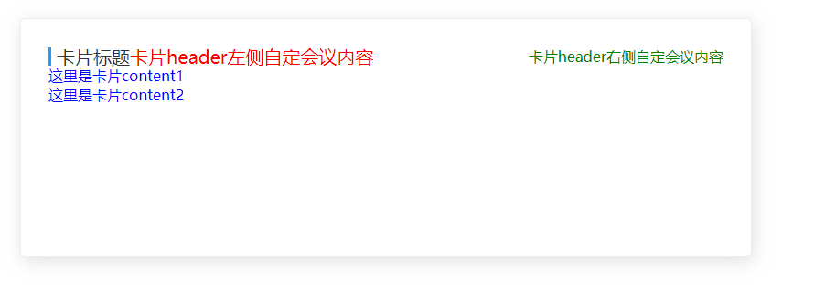

# 卡片

该组件是卡片，主要用于统一样式

## 样式



## Attributes

| 参数   | 说明     | 类型   | require | 默认值 |
| ------ | -------- | ------ | ------- | ------ |
| title  | 卡片标题 | String | false   | title  |
| height | 卡片高度 | String | false   | auto   |

## slot

| name         | 说明                   |
| ------------ | ---------------------- |
| header-left  | 卡片头部左侧自定义内容 |
| header-right | 卡片头部右侧自定义内容 |
| default      | 卡片内容               |

## Example

```JavaScript
<template>
    <div style="width: 800px">
        <mi-card title="卡片标题" height="200px">
            <div slot="header-left" style="color: red">卡片header左侧自定会议内容</div>
            <div slot="header-right" style="color: green">卡片header右侧自定会议内容</div>
            <p style="color: blue">这里是卡片content1</p>
            <p style="color: blue">这里是卡片content2</p>
        </mi-card>
    </div>
</template>

```
