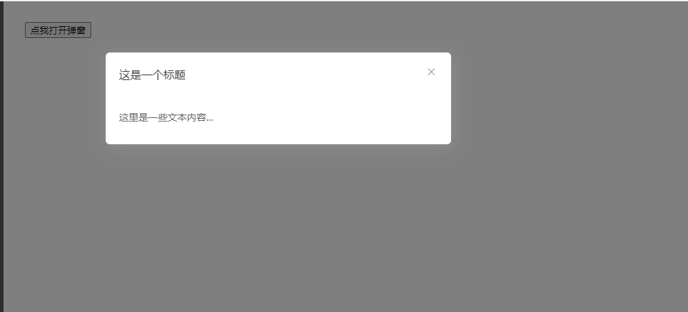

# 对话框

该组件是对话框，使用时只需要在该组件内部插入需要的内容即可,主要用于统一样式

## 样式



## Attributes

| 参数          | 说明     | 类型    | require | 默认值 |
| ------------- | -------- | ------- | ------- | ------ |
| value/v-model | 绑定值   | Boolean | true    | false  |
| width         | 弹窗宽度 | String  | false   | 500px  |
| title         | 标题     | String  | true    | title  |

## Events

| 参数         | 说明                 | 回调参数 |
| ------------ | -------------------- | -------- |
| before-close | 弹窗关闭时的回调函数 | --       |

## Example

```JavaScript
<template>
    <div>
        <button @click="visible = true">点我打开弹窗</button>
        <mi-dialog v-model="visible" title="这是一个标题" @before-close="closeHandle"> 这里是一些文本内容... </mi-dialog>
    </div>
</template>
<script>
export default {
    data() {
        return {
            visible: false
        }
    },
    methods: {
        closeHandle() {
            console.log('弹窗关闭了')
        }
    }
}
</script>

```
