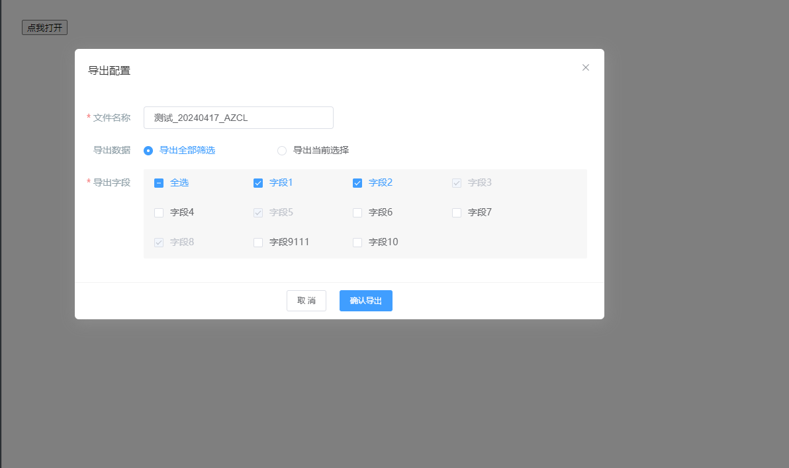

# 导出列表数据

该组件用于导出列表数据

## 样式



## MiExport Attributes

| 参数          | 说明           | 类型          | require | 默认值 |
| ------------- | -------------- | ------------- | ------- | ------ |
| value/v-model | 绑定值         | Boolean | true    | false     |
| fileName | 导出文件名称         | String | true    | ''     |
| selectFields       | 当前选中的字段     | Array       | false   | []  |
| selectFields   | 列表中选中的行 | Array        | false   | []     |
| dialogWidth         | 对话框宽度       | String        | false   | 755px  |
| currSelectShow          | 是否展示 【导出当前选择】 | Boolean         | false    | true     |
| selectAllName          | 【导出全部筛选】重命名 | String         | false    | 导出全部筛选     |
| currSelectName          |【导出当前选择】重命名 | String         | false    | 导出当前选择     |
| fieldShow          | 是否展示 【导出字段】 | Boolean         | false    | true     |
| loading          | 按钮loading状态控制 | Boolean         | false    | false     |

## MiExport Events

| 参数   | 说明                 | 回调参数     |
| ------ | -------------------- | ------------ |
| submit | 点击确认导出触发 | {name：'文件名称', type: '导出数据类型：1-导出全部筛选， 2-导出当前选择'， field： '选中字段数组'} |


## MiExOption Attributes

| 参数          | 说明           | 类型          | require | 默认值 |
| ------------- | -------------- | ------------- | ------- | ------ |
| value | 	选项的值         | String/Number | true    | --     |
| label | 选项的标签         | String/Number | true    | --     |
| disabled   | 是否禁用该选项 | Boolean         | false    | false     |

## Example

```JavaScript
<template>
    <div>
        <mi-export
            v-model="visible"
            fileName="测试"
            :selectFields="select"
            @submit="submit"
            :loading.sync="loading"
            :selectLines="[1, 2, 3]"
            :currSelectShow="true"
            selectAllName="全部导出"
            currSelectName="导出选中的数据"
            dialogWidth="800px"
        >
            <mi-ex-option value="1" label="字段1"></mi-ex-option>
            <mi-ex-option value="2" label="字段2"></mi-ex-option>
            <mi-ex-option value="3" label="字段3" disabled></mi-ex-option>
            <mi-ex-option value="4" label="字段4"></mi-ex-option>
            <mi-ex-option value="5" label="字段5" disabled></mi-ex-option>
            <mi-ex-option value="6" label="字段6"></mi-ex-option>
            <mi-ex-option value="7" label="字段7"></mi-ex-option>
            <mi-ex-option value="8" label="字段8" disabled></mi-ex-option>
            <mi-ex-option value="9" label="字段9111"></mi-ex-option>
            <mi-ex-option value="10" label="字段10"></mi-ex-option>
        </mi-export>
        <button @click="visible = !visible">点我打开</button>
    </div>
</template>
<script>
export default {
    data() {
        return {
            visible: false,
            select: ['1', '2', '3'],
            loading: false
        }
    },
    methods: {
        submit(val) {
            console.log('submit', val)
            setTimeout(() => {
                this.loading = false
                this.visible = false
            }, 2000)
        }
    }
}
</script>

```
