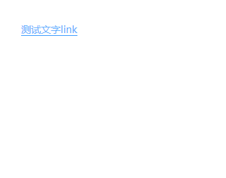

# 文字link

该组件是文字link，主要用于统一样式，该组件暂不提供其它功能，如href、disabled等

## 样式



## slot

| name         | 说明                   |
| ------------ | ---------------------- |
| default      | 文字内容               |

## Example

```JavaScript
<template>
    <mi-link>测试文字link</mi-link>
</template>
```
