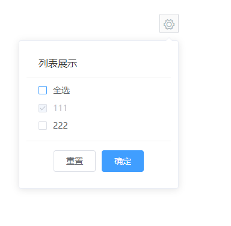

# 列表展示

该组件用于配置列表展示项

## 样式



## MiListDisplay Attributes

| 参数          | 说明   | 类型  | require | 默认值 |
| ------------- | ------ | ----- | ------- | ------ |
| value/v-model | 绑定值 | Array | true    | []     |

## MiListDisplay Events

| 参数   | 说明               | 回调参数     |
| ------ | ------------------ | ------------ |
| reset  | 点击重置按钮时触发 | --           |
| submit | 点击确定按钮时触发 | 目前的选中值 |

## MiListOption Attributes

| 参数     | 说明           | 类型          | require | 默认值 |
| -------- | -------------- | ------------- | ------- | ------ |
| label    | 选项的标签     | string/number | true    | --     |
| value    | 选项的值       | string/number | true    | --     |
| disabled | 是否禁用该选项 | Boolean       | false   | false  |

## Example

```JavaScript
<template>
    <div style="margin-left: 500px">
        <mi-list-display v-model="value" @reset="reset" @submit="submit">
            <mi-list-option label="111" value="a" disabled></mi-list-option>
            <mi-list-option label="222" value="b"></mi-list-option>
        </mi-list-display>
    </div>
</template>
<script>
export default {
    data() {
        return {
            value: ['a']
        }
    },
    methods: {
        reset() {
            console.log('重置')
        },
        submit() {
            console.log('确定')
        }
    }
}
</script>

```
