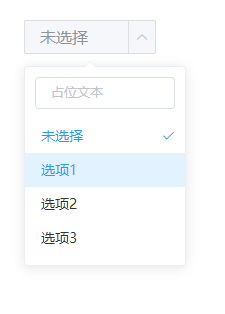
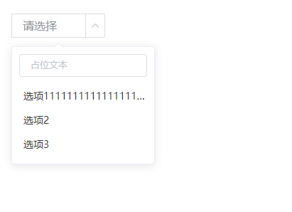

# 选择器

该组件是选择器，因为使用了 滚动加载，所以支持数据量较大的情况。组件为 块级 元素，建议搭配 flex 使用

## 样式




## Attributes

| 参数          | 说明           | 类型          | require | 默认值 |
| ------------- | -------------- | ------------- | ------- | ------ |
| value/v-model | 绑定值         | String/number | true    | ""     |
| isQuery       | 是否可搜索     | Boolean       | false   | false  |
| placeholder   | 输入框占位文本 | String        | false   | ""     |
| width         | 组件宽度       | String        | false   | 132px  |
| data          | 下拉框列表数据 | Array         | true    | []     |
| whiteTheme       | 是否展示白色主题     | Boolean       | false   | false  |
| popperClass   | 为 popper 添加类名 | String        | false   | ""     |
| defaultValue   | 占位符，当value 为空时展示 | String        | false   | ""     |

## Events

| 参数   | 说明                 | 回调参数     |
| ------ | -------------------- | ------------ |
| change | 选中值发生变化时触发 | 目前的选中值 |

## Example

```JavaScript
<template>
    <div>
        <mi-select v-model="sId" :data="list" isQuery placeholder="占位文本"></mi-select>
    </div>
</template>
<script>
export default {
    data() {
        return {
            sId: '',
            list: [
                {
                    label: '未选择',
                    value: ''
                },
                {
                    label: '选项1',
                    value: '1'
                },
                {
                    label: '选项2',
                    value: '2'
                },
                {
                    label: '选项3',
                    value: '3'
                }
            ]
        }
    }
}
</script>

```
